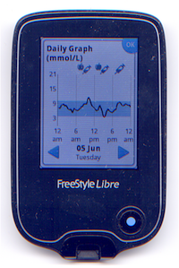
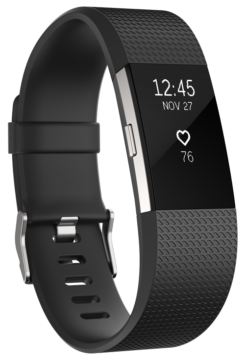

**Nobody wants diabetes. It comes of its own, unbidden**. For some, "Big D" has been a part of their life since childhood. For others it strikes in middle age or even later. That's what happened to me: I have the little-known LADA diabetes, an auto-immune condition. It struck me later in life, coming out of the blue as a complete shock.

**I suppose it was creeping up on me for years, maybe even decades**. Perhaps I even had it from early childhood. I was not a strong child, and growing up in the dirty, smoke-ridden air of the industrial city of Manchester, UK I suffered from bronchitis incessantly each winter. 

**But once the condition is accepted as a fact, the question becomes how to adapt to it**. Some people don't get to that stage; they struggle against managing it and eventually succumb to its long-term depradations --- necrosis of the extremities leading to amputation; major organ failure; eye disease; a heart attack. I had a brush with a couple of those, but luckily emerged relatively unscathed.

**My approach to adaptation has been to regard the misfortune of having diabetes as an opportunity**. I started collecting all the data from my various blood sugar meters, and eventually acquired a [Fitbit](https://www.fitbit.com/en-ca/charge2) that monitors heart rate and exercise data.

**I now have over six months of fine-grained data. The next step is to analyse it**. I've been finding out about [Data Analysis](https://en.wikipedia.org/wiki/Data_analysis) and started learning the [R statistical programming language](https://r.stuzog.com/). It's been an interesting exploration, which I'll tell you more about as things unfold.

*You can track this project by clicking the [data-science](/tags/data-science) tag.*

